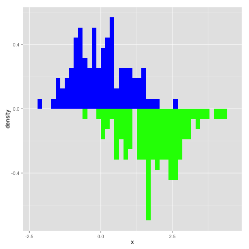
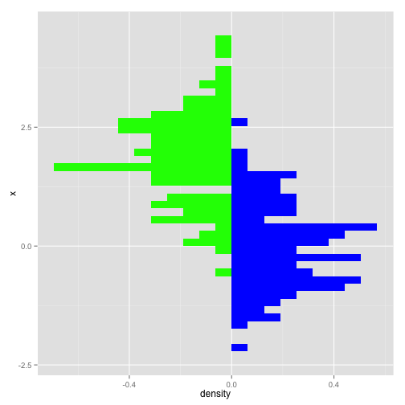
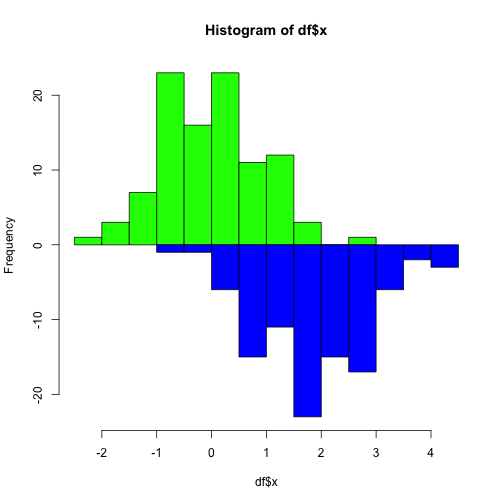

A colleage of mine asked me how to do back to back histograms (instead of on top of each other).  I feel as though there should be a function like [voilin plot](http://en.wikipedia.org/wiki/Violin_plot) from the [vioplot](http://cran.r-project.org/web/packages/vioplot/index.html) package.  Voilin plots are good for displaying data, but the violin must have the left and right (or top and bottom) of the violin to be from the same distribution, and therefore are symmetrical.  Many times people want to compare two distributions.  

[Cookbook for R]( http://www.cookbook-r.com/Graphs/Plotting_distributions_(ggplot2) ) shows how to overlay histograms (or densities) on top of each other, so go there if that's what you want.  (NB: that is the way I tend to compare distributions, especially more than 2.  I provide the code below because some have different preferences.)

### ggplot implementation:


```r
library(ggplot2)
df = data.frame(x = rnorm(100), x2 = rnorm(100, mean=2))

g = ggplot(df, aes(x)) + geom_histogram( aes(x = x, y = ..density..),
                                             binwidth = diff(range(df$x))/30, fill="blue") + 
  geom_histogram( aes(x = x2, y = -..density..), binwidth = diff(range(df$x))/30, fill= "green")
print(g)
```

```
## Warning: Stacking not well defined when ymin != 0
```

 

I simply simulated 2 normal distributions of 100 points and then plotted them.  Not the `..density` call in the `aes` for the histograms.  This just scales the histogram to a density and not a count.  The `-..density..` flips the second histogram around zero so that they are back-to-back.  We see that `ggplot` doesn't like stacking when you have negative data, but it's ok for this exmaple and don't overlap.


```r
print(g + coord_flip())
```

```
## Warning: Stacking not well defined when ymin != 0
```

 

Using `coord_flip` plots back-to-back histograms horizontally.  This code can easily be extended using `geom_density` and actually a volcano plot version is in the help for `stat_density`.

### Base implementation

[Not everyone likes `ggplot2`](https://www.linkedin.com/groups/ggplot-nightmare-77616.S.5845160629379297280) so I figured I would provide in implementation in base graphics.


```r
## using base
h1 = hist(df$x, plot=FALSE)
h2 = hist(df$x2, plot=FALSE)
h2$counts = - h2$counts
hmax = max(h1$counts)
hmin = min(h2$counts)
X = c(h1$breaks, h2$breaks)
xmax = max(X)
xmin = min(X)
plot(h1, ylim=c(hmin, hmax), col="green", xlim=c(xmin, xmax))
lines(h2, col="blue")
```

 

The code calculates the histograms for each distribution and stores the information.  I simply take the negative number of counts to flip the histogram over the x-axis.  

### Go forth and prosper
You can adjust the axes to positive numbers, make more implementations with densities/etc, but this is a simple graphic I've seen people use.  Hope this helps someone out. 
