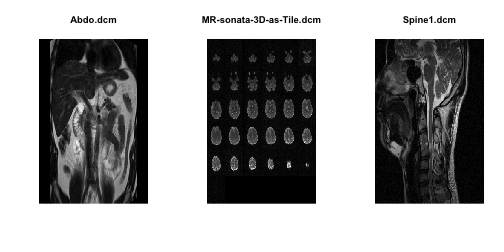

## Neuroimaging and `R`

I use neuroimaging data in a lot of my day to day work.  I also use `R`.  The overlap is diligently located [here](http://cran.r-project.org/web/views/MedicalImaging.html).   The common format for that is [DICOM](http://dicom.nema.org/), which outputs each slice of an image as a different file.  This is fine for many uses, especially for physicians/radiologists, who have software either built into [compact discs, also known as CDs](http://en.wikipedia.org/wiki/Compact_disc) for the future readers or [DVDs](http://en.wikipedia.org/wiki/DVD) that open the images automatically when the disc is inserted.  

A few potential drawbacks of this format are:
  * Files for a whole brain/image need to be organized somehow by good naming conventions or file structures
  * Some operations require a 3D volume (such as smoothing, local moment calculations, etc)
  * Some of the top software (SPM, FSL) require either NIfTI or ANALYZE format (3D).

## `oro.dicom`
So I use the `oro.dicom` and `oro.nifti` packages in `R`.  They're awesome and essential if you do neuroimaging in `R`.  Not only will they read/write gzipped files without having to code that small step on your own (and remember to cleanup) like in the `AnalyzeFMRI` package, it can do the DICOM to NIfTI conversion (`dicom2nifti`).  If you use DICOM formats and haven't used it before, I definitely suggest checking it out.  A followup post will be detailing an entire pipeline using `R` and `FSL` and maybe `SPM` from start to finish.

For now, I just want to discuss the header informtion in DICOM files.  Although there are drawbacks aforementioned, the format allows for immense flexibility of images (sometimes to the chagrin of analysts).  For example, we have scans that have "variable slice thickness".  Think of it as taking thick-slab bacon slices of the brain at the top and bottom of the brain, and extra thin slices in the middle.  Thus, you can see high resolution in the middle of the brain, but don't really care about the top or bottom of the brain as much.  This allows for differential acquisition, but may not be able to be recorded in one NIfTI file accurately.

### DICOM Headers
So how do you get that information; where is it?  In the DICOM header.  Now, the `readDICOM` function will attempt to read an entire directory (even if not all the files are DICOM format).  It iteratively calls `readDICOMFile` to read each individual DICOM.  It stores the information into a `hdr` element and `img` element, which are lists with length being the number of files.

Looking at the DICOM files included with the `oro.dicom` package:

```r
library(oro.dicom)
### from the readDICOMFile help file (adapted)
dcm <- readDICOM(system.file("dcm", package = "oro.dicom"))
hdr = dcm$hdr
tail(hdr[[1]])
```

```
   group element                name code length     value sequence
79  0028    0101          BitsStored   US      2        12         
80  0028    0102             HighBit   US      2        11         
81  0028    0103 PixelRepresentation   US      2         0         
82  0028    1050        WindowCenter   DS      4       530         
83  0028    1051         WindowWidth   DS      4      1052         
84  7FE0    0010           PixelData   OB 131072 PixelData         
```

```r
class(hdr[[1]])
```

```
[1] "data.frame"
```

```r
tail(hdr[[2]])
```

```
    group element                                  name code length
136  0028    1103 BluePaletteColorLookupTableDescriptor   US      6
137  0028    1201        RedPaletteColorLookupTableData   OW    256
138  0028    1202      GreenPaletteColorLookupTableData   OW    256
139  0028    1203       BluePaletteColorLookupTableData   OW    256
140  7FE0    0010                             PixelData   OB   4096
141  7FE0    0010                             PixelData   OB 294912
        value     sequence
136       256            0
137      <NA>  (0088,0200)
138      <NA>  (0088,0200)
139      <NA>  (0088,0200)
140      <NA>  (0088,0200)
141 PixelData             
```


## DICOM Header Information
We see the DICOM header is encoded as a `data.frame` and ends with a `PixelData` field (which is the matrix of data).  Also, we see that for the first two files, they have different fields in the `name` column.  So if we have to extract information about the `HighBit` for example, we'd have to run:

```r
hdr[[1]][hdr[[1]]$name == "HighBit", ]
```

```
   group element    name code length value sequence
80  0028    0102 HighBit   US      2    11         
```

```r
hdr[[2]][hdr[[2]]$name == "HighBit", ]
```

```
    group element    name code length value     sequence
97   0028    0102 HighBit   US      2    11             
132  0028    0102 HighBit   US      2     7  (0088,0200)
```

We see that some fields are replicated, which is a problem.  But let us assume we had data that had each field once.  I just wanted to create a simple function that would create one `data.frame` for all the DICOM files together.

Here's the function to parse these already read-in list of `hdr`. 

```r
dicom_header_parse = function(hdr, tryConvert = TRUE, stop.dups = FALSE) {
    ### get all unique fields
    nfiles = length(hdr)
    all.names = unique(unlist(lapply(hdr, function(x) x[, "name"])))
    n.names = length(all.names)
    
    ## create a matrix to fill in
    mat = matrix(NA, nrow = nfiles, ncol = n.names)
    colnames(mat) = all.names
    
    ## extract information for each file
    for (ifile in seq(nfiles)) {
        x = hdr[[ifile]]
        val = x[, c("value")]
        xnames = x[, "name"]
        if (stop.dups) 
            stopifnot(all(!duplicated(xnames)))
        nn = names(val) = xnames
        mat[ifile, nn] = val[nn]
    }
    
    
    mat = data.frame(mat, stringsAsFactors = FALSE)
    ## Try to convert the numeric fields to numeric?
    if (tryConvert) {
        for (icol in seq(n.names)) {
            mat[, icol] = make.numeric(mat[, icol])
        }
    }
    ### this will have the rownames to be the file names
    rownames(mat) = names(hdr)
    return(mat)
}
```


This function will not handle the duplications like `HighBit` as before (it will tak the first record as per `R` convention).  This usually is not the case with most DICOM fields, and added checks can be added (such as the `stop.dups`) that will error out to have a user check header information or define how values shoudl be extracted.  Either way, I use this enough to write a post about it.

This also depends on the function `make.numeric`, which simply tries to coerce a vector into a numeric, and if any NAs are created, it simply returns the original vector unchanged.  


```r

make.numeric <- function(x) {
    if (is.factor(x)) 
        x <- as.character(x)
    oldx <- x
    x[x == ""] <- NA
    if (all(is.na(x))) 
        return(oldx)
    ## if they all are real - turn to numeric
    suppressWarnings(num_x <- as.numeric(x))
    keep <- !(is.na(x) & is.na(num_x))
    ### if all numeric
    if (any(is.na(num_x[keep]))) {
        return(oldx)
    } else {
        return(num_x)
    }
}
```


```r
hdr.df = dicom_header_parse(dcm$hdr, tryConvert = TRUE)
head(hdr.df[, c("ImageType", "SeriesDescription", "StudyDescription")])
```

```
                                                                                                                         ImageType
/Library/Frameworks/R.framework/Versions/3.0/Resources/library/oro.dicom/dcm/Abdo.dcm                  ORIGINAL PRIMARY OTHER M SE
/Library/Frameworks/R.framework/Versions/3.0/Resources/library/oro.dicom/dcm/MR-sonata-3D-as-Tile.dcm ORIGINAL PRIMARY M ND MOSAIC
/Library/Frameworks/R.framework/Versions/3.0/Resources/library/oro.dicom/dcm/Spine1.dcm                ORIGINAL PRIMARY OTHER M SE
                                                                                                                                             SeriesDescription
/Library/Frameworks/R.framework/Versions/3.0/Resources/library/oro.dicom/dcm/Abdo.dcm                 Liver SpleeT2W UTSE RC$ COR    TSE   2000      100    90
/Library/Frameworks/R.framework/Versions/3.0/Resources/library/oro.dicom/dcm/MR-sonata-3D-as-Tile.dcm                                         ep2d_BOLD_evntX4
/Library/Frameworks/R.framework/Versions/3.0/Resources/library/oro.dicom/dcm/Spine1.dcm               Cervical   *T2W TSE     SAG    TSE   3000      130    90
                                                                                                      StudyDescription
/Library/Frameworks/R.framework/Versions/3.0/Resources/library/oro.dicom/dcm/Abdo.dcm                          ABDOMEN
/Library/Frameworks/R.framework/Versions/3.0/Resources/library/oro.dicom/dcm/MR-sonata-3D-as-Tile.dcm     CERMEP NEURO
/Library/Frameworks/R.framework/Versions/3.0/Resources/library/oro.dicom/dcm/Spine1.dcm                        C-SPINE
```


Now let's see what our data is:

```r
### get the file names (without path)
fnames = basename(rownames(hdr.df))
par(mfrow = c(1, 3))
graphics::image(t(dcm$img[[1]]), col = grey(0:64/64), axes = FALSE, xlab = "", 
    ylab = "", main = fnames[1])
graphics::image(t(dcm$img[[2]]), col = grey(0:64/64), axes = FALSE, xlab = "", 
    ylab = "", main = fnames[2])
graphics::image(t(dcm$img[[3]]), col = grey(0:64/64), axes = FALSE, xlab = "", 
    ylab = "", main = fnames[3])
```

 


## Conclusions
DICOM formats are good for some things, but not for all.  One good thing is the richness of the header information, and handling this information can help organize, name, and subset files based on criteria.  Therefore, added functions for header manipulation may assist users.
