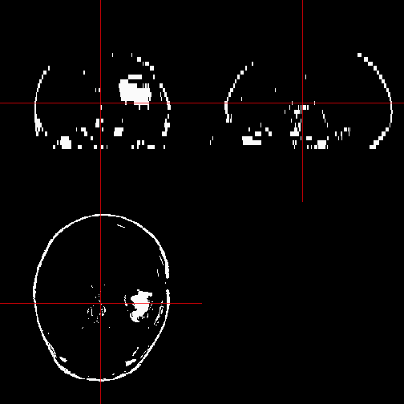

# DICOM to NIfTI Conversion in R


## Introduction

This vignette describes how to convert from DICOM format to NIfTI using the `oro.dicom` package and useful `R` functions to read and write NIfTI files using the `oro.nifti` package.

Let's first install these packages.

```r
install_github('muschellij2/ENARSC2015')
# install.packages(c("oro.dicom", "oro.nifti"))
```

## Reading in DICOM data

The workhorse function for reading in DICOM data is the `readDICOMFile` function in `oro.dicom`, where individual filenames are passed to be read.  The `readDICOM` function wraps this function and converts all DICOM files in a path into one list of data.  The `dicom2nifti` function takes the list of header information and array of values and creates a 3D `nifti` object.


```r
dcm2nii <- function(path, ## path to DICOM files
                    outfile = NULL, ## output filename
                    retimg = TRUE, # write file out to disk?
                    ... # additional options to \code{\link{readDICOM}}
                    ){
  dicom <- readDICOM(path, flipud = FALSE, ...)
  nifti <- dicom2nifti(dicom)
  write = !is.null(outfile)
  if (retimg){
    if (is.null(outfile)) {
      outfile = tempfile()
      outfile = nii.stub(outfile)      
    }
  } else {
    stopifnot(!is.null(outfile))
  }
  
  if (write){
    writeNIfTI(nifti, filename = outfile, 
               verbose = TRUE, gzipped = TRUE)
  } 
  return(nifti)
}
```

Let's specify an output directory: `~/Desktop/results` where the output images should be.


```r
library(oro.dicom)
library(oro.nifti)

# output directory for nifti files
outdir = "~/Desktop/results"
outdir = path.expand(outdir)

if (!file.exists(outdir)){
  dir.create(outdir, showWarnings =  FALSE)
}

# Data taken from http://www.osirix-viewer.com/datasets/
mods = c("T1", "T2", "FLAIR", "ROI")
hdrs = imgs = vector(mode="list", length= length(mods))
names(imgs) = names(hdrs) = mods
imod = 1
for (imod in seq_along(mods)){
  mod = mods[imod]
  dicom_path = system.file(file.path("DICOM", mod), package="ENARSC2015")
  fname = file.path(outdir, mod)
  headers <- readDICOM(dicom_path, pixelData=FALSE)$hdr
  hdrs[[imod]] = dicomTable(headers)
  img = dcm2nii(dicom_path, retimg = TRUE, outfile = fname)
  imgs[[imod]] = img
}
```

```
  writing data at byte = 352
  writing data at byte = 352
  writing data at byte = 352
  writing data at byte = 352
```

Some warnings may occur for this data.  Some data may not be correctly converted if they were acquired in a non-standard way.

### Explanation of Code
In 

> `dicom_path = system.file(file.path("DICOM", mod), package="ENARSC2015")`

We grabbed the directory for the DICOM data from the `ENARSC2015` directory.  The directories are mapped such as `DICOM/T1`.  The `readDICOM` function takes this directory, parses the DICOM files, and returns a list with slots `hdr` and `img`:

> `headers <- readDICOM(dicom_path, pixelData=FALSE)$hdr`

and note that `readDICOM` will **recursively** go through folders by default.  We specified `pixelData=FALSE`, indicated that `img` should be empty and only the header (metadata) should be read in.  Changing `dicom_path` to the path of your DICOM data is required, as well as output filenames

The 

> `hdrs[[imod]] = dicomTable(headers)`

command used the `dicomTable` function to reshape the list of headers in to a `data.frame` with rows being images and columns being information form the header.

Let us look at the header:

```r
class(hdrs[["T1"]])
```

```
[1] "data.frame"
```

```r
rn = rownames(hdrs[["T1"]])
head(rn, 2)
```

```
[1] "/Library/Frameworks/R.framework/Versions/3.1/Resources/library/ENARSC2015/DICOM/T1/IM-0001-0001.dcm"
[2] "/Library/Frameworks/R.framework/Versions/3.1/Resources/library/ENARSC2015/DICOM/T1/IM-0001-0002.dcm"
```

```r
rownames(hdrs[["T1"]]) = basename(rn)
hdrs[["T1"]][1:5, 1:5]
```

```
                 0002-0000-GroupLength
IM-0001-0001.dcm                   210
IM-0001-0002.dcm                   210
IM-0001-0003.dcm                   210
IM-0001-0004.dcm                   210
IM-0001-0005.dcm                   210
                 0002-0001-FileMetaInformationVersion
IM-0001-0001.dcm                                 \001
IM-0001-0002.dcm                                 \001
IM-0001-0003.dcm                                 \001
IM-0001-0004.dcm                                 \001
IM-0001-0005.dcm                                 \001
                 0002-0002-MediaStorageSOPClassUID
IM-0001-0001.dcm         1.2.840.10008.5.1.4.1.1.4
IM-0001-0002.dcm         1.2.840.10008.5.1.4.1.1.4
IM-0001-0003.dcm         1.2.840.10008.5.1.4.1.1.4
IM-0001-0004.dcm         1.2.840.10008.5.1.4.1.1.4
IM-0001-0005.dcm         1.2.840.10008.5.1.4.1.1.4
                                          0002-0003-MediaStorageSOPInstanceUID
IM-0001-0001.dcm 1.3.46.670589.11.0.0.11.4.2.0.8743.5.5396.2006120114374728600
IM-0001-0002.dcm 1.3.46.670589.11.0.0.11.4.2.0.8743.5.5396.2006120114374689599
IM-0001-0003.dcm 1.3.46.670589.11.0.0.11.4.2.0.8743.5.5396.2006120114374651598
IM-0001-0004.dcm 1.3.46.670589.11.0.0.11.4.2.0.8743.5.5396.2006120114374612597
IM-0001-0005.dcm 1.3.46.670589.11.0.0.11.4.2.0.8743.5.5396.2006120114374573596
                 0002-0010-TransferSyntaxUID
IM-0001-0001.dcm         1.2.840.10008.1.2.1
IM-0001-0002.dcm         1.2.840.10008.1.2.1
IM-0001-0003.dcm         1.2.840.10008.1.2.1
IM-0001-0004.dcm         1.2.840.10008.1.2.1
IM-0001-0005.dcm         1.2.840.10008.1.2.1
```
The filenames are the rownames of the `data.frame`. 

If we look at the column names of the `data.frame`, we see that they are a combination of the key information from the DICOM and the field name.

```r
colnames(hdrs[["T1"]])[1:5]
```

```
[1] "0002-0000-GroupLength"               
[2] "0002-0001-FileMetaInformationVersion"
[3] "0002-0002-MediaStorageSOPClassUID"   
[4] "0002-0003-MediaStorageSOPInstanceUID"
[5] "0002-0010-TransferSyntaxUID"         
```

You may want to strip these off and simply use the field names.

```r
head(gsub(".*-(.*)", "\\1", colnames(hdrs[["T1"]])), 10)
```

```
 [1] "GroupLength"                  "FileMetaInformationVersion"  
 [3] "MediaStorageSOPClassUID"      "MediaStorageSOPInstanceUID"  
 [5] "TransferSyntaxUID"            "ImplementationClassUID"      
 [7] "ImplementationVersionName"    "SourceApplicationEntityTitle"
 [9] "SpecificCharacterSet"         "ImageType"                   
```
There may be cases that these are not unique and subsetting the columns you want is a better strategy.

The `dcm2nii` function specified above wraps the 2 steps of reading in the DICOM data into an object and then using `dicom2nifti` on the object to convert the multiple DICOM slices into one 3D volume.  The results is a `nifti` object that can be written using `writeNIfTI` from the `oro.nifti` package and `dcm2nii` returns this nifti object of the image. 

## nifti objects

The `imgs` list is a list of objects of class `nifti`.

```r
sapply(imgs, class)
```

```
     T1      T2   FLAIR     ROI 
"nifti" "nifti" "nifti" "nifti" 
```

```r
imgs[["FLAIR"]]
```

```
NIfTI-1 format
  Type            : nifti
  Data Type       : 4 (INT16)
  Bits per Pixel  : 16
  Slice Code      : 0 (Unknown)
  Intent Code     : 0 (None)
  Qform Code      : 2 (Aligned_Anat)
  Sform Code      : 2 (Aligned_Anat)
  Dimension       : 288 x 288 x 22
  Pixel Dimension : 0.8 x 0.8 x 5
  Voxel Units     : mm
  Time Units      : sec
```
The output shows some information about the `nifti` object, such as dimensions and pixel resolution.  These are S4 objects and must be referenced by the @ symbol for slots or functions that extract these slots.


```r
head(slotNames(imgs[["FLAIR"]]))
```

```
[1] ".Data"         "sizeof_hdr"    "data_type"     "db_name"      
[5] "extents"       "session_error"
```

```r
imgs[["FLAIR"]]@dim
```

```
[1] 288 288  22
```

```r
dim(imgs[["FLAIR"]])
```

```
[1] 288 288  22
```

```r
imgs[["FLAIR"]]@pixdim
```

```
[1] -1.0000  0.7986  0.7986  5.0000  1.0000  1.0000  1.0000  1.0000
```

The array of values are located in the `.Data` slot, but most array operations can be used on a `nifti` object, such as taking values greater than zero and taking the mean to get the proportion of the image greater than 0 or simple subsetting and replacement as in arrays.


```r
i = imgs[["FLAIR"]]
mean(i > 0)
```

```
[1] 0.6342
```

```r
i[i < 0 ]= NA
```
## Reading and Displaying in NIfTI data

Now that we have NIfTI files, we can read them in directly:


```r
fname = file.path(outdir, "FLAIR")
img = readNIfTI(fname)
```

We can plot the data using the `orthographic` function from `oro.nifti`:

```r
orthographic(img, text="FLAIR image")
```

 

```r
image(img)
```

 

```r
image(img, z = 10, plot.type="single")
```

 

If we have an array, we can create `nifti` object with the `nifti` command:

```r
arr = img > 100 & img < 300
class(arr)
```

```
[1] "array"
```

```r
nim = nifti(arr, dim = dim(img), pixdim=pixdim(img))
orthographic(nim)
```

 

We can also present overlays on images.  Note we have to remove 0's from the image or it will color these as well.


