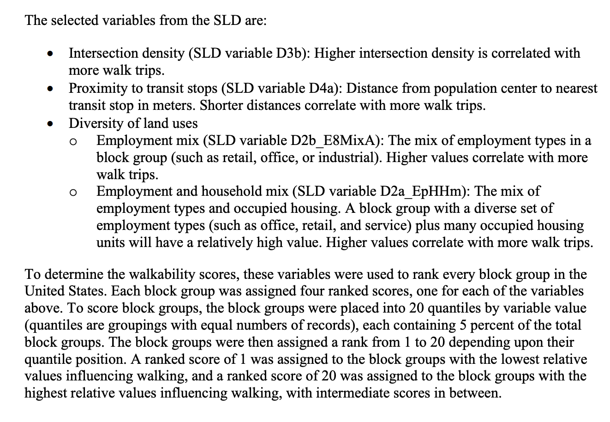
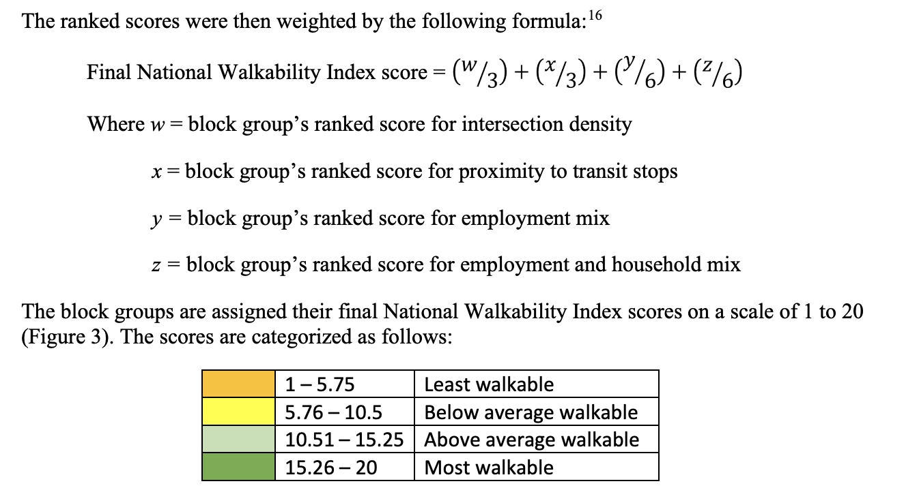
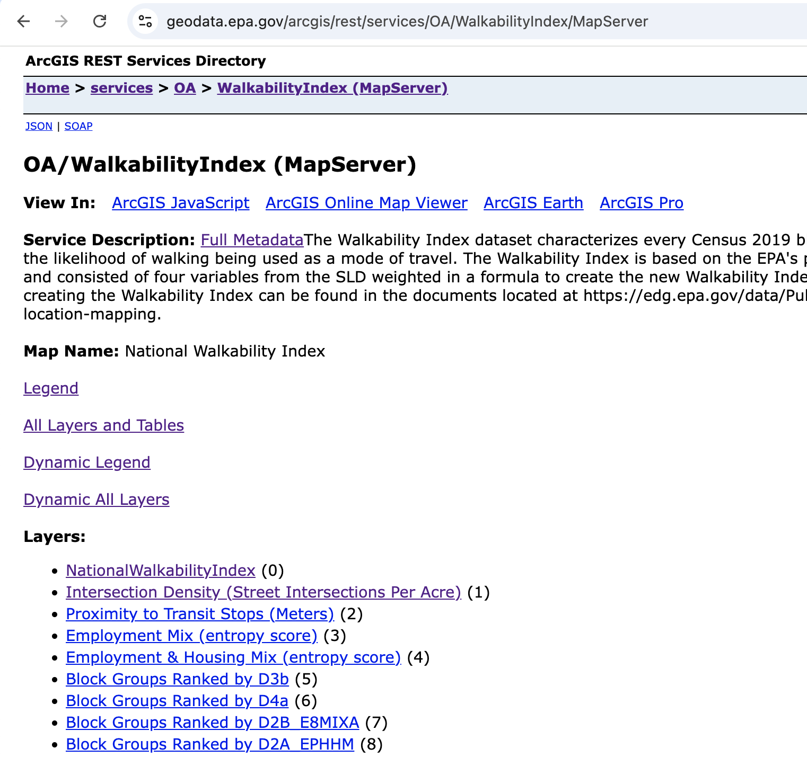
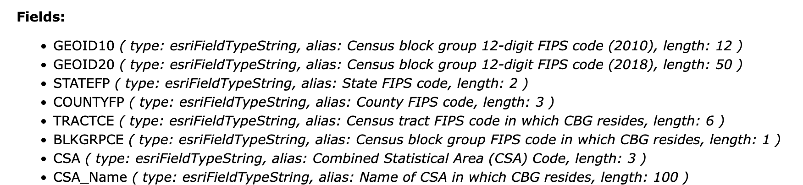
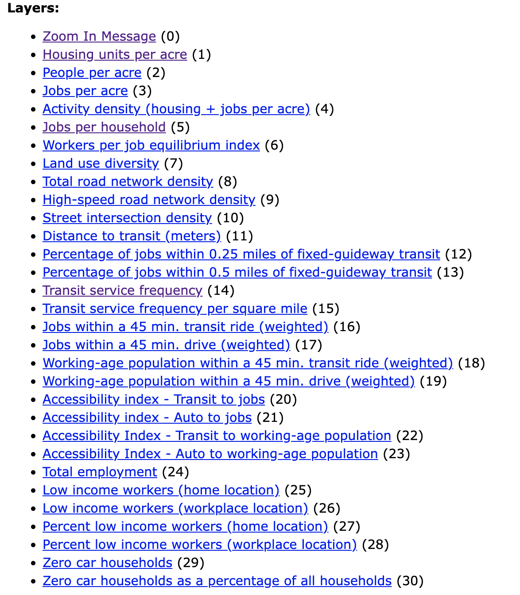

```{r label=opts, results='hide', echo=FALSE, message = FALSE, warning=FALSE}
library(knitr)
library(dplyr)
library(arcgis)
opts_chunk$set(echo = TRUE, prompt = FALSE, message = FALSE, warning = FALSE, comment = "", results = "hide")
```

# Objective
In this quick tutorial, we will go over how to get the [EPA Walkability Index](https://catalog.data.gov/dataset/walkability-index7) for an address in the USA.  We will show how to map the address to the [Federal Information Processing Standard (FIPS)](https://transition.fcc.gov/oet/info/maps/census/fips/fips.txt) code and then map that code into the Walkability Index.

# The Walkability Index
The Walkability Index is derived from the [Smart Location Database](https://www.epa.gov/smartgrowth/smart-location-mapping), which has a number of additional measures for each census block, which may be relevant to research.  Websites like Zillow use a different service, called the [Walk Score](https://www.walkscore.com/), which is another data resource that has APIs, but is not covered here.

You can see the information for the walkability index at https://www.epa.gov/smartgrowth/national-walkability-index-user-guide-and-methodology. Namely, the [National Walkability Index Methodology and User Guide PDF](https://www.epa.gov/sites/default/files/2021-06/documents/national_walkability_index_methodology_and_user_guide_june2021.pdf) is a good explanation of how the index is created and derived.  Specifically, the index is derived by:


```{r, results='markup', echo = FALSE}

```

And the index is scored and categorized using the following formula:

```{r, results='markup', echo = FALSE}

```


# Getting the Walkability Index

The walkability index is provided via an [ArcGIS Map Service/MapServer](https://enterprise.arcgis.com/en/server/11.3/publish-services/linux/what-is-a-map-service.htm).  The URL is located at https://geodata.epa.gov/arcgis/rest/services/OA/WalkabilityIndex/MapServer, which we can see a snapshot of its documentation:

```{r, results='markup', echo = FALSE}

```

Note here that there are other endpoints of the MapServer other than the Walkability Index, but the Walkability Index is indexed as **0**, so that the URL for the Walkability endpoint is https://geodata.epa.gov/arcgis/rest/services/OA/WalkabilityIndex/MapServer/0.  Looking at this endpoint, we can see the fields of the data.  Namely, we are focused on the `GEOID10`/`GEOID20` fields which are the FIPS codes for different Census years and `NatWalkInd ( type: esriFieldTypeDouble, alias: Walkability Index )`, which is the walkability index:


```{r, results='markup', echo = FALSE}

```

I chose the 2010 Census FIPS as the documentation said the 2019 ACS/Census fields but the field name said 2018.

## Using `arcgis` Package to Access the Walkability Index

The [`arcgis` package](https://github.com/R-ArcGIS/arcgis) package allows us to easily interact with ArcGIS map servers and extract information from them in a nice, tidy way.  The package can be installed via:

```{r, eval = FALSE}
remotes::install_github("https://github.com/R-ArcGIS/arcgis")
# Alternative
install.packages("arcgis", repos = "https://r-arcgis.r-universe.dev")
```

Once downloaded, you can load the package and open the connection to the server via `arc_open`:

```{r, message=FALSE, results='markup'}
library(arcgis)
url <- "https://geodata.epa.gov/arcgis/rest/services/OA/WalkabilityIndex/MapServer/0"
(walk_arc <- arc_open(url))
```
You can download the entire dataset via `arc_select`:

```{r, eval = FALSE}
res = arc_select(walk_arc)
```

If you do not need the geometry/polygon/spatial information, you can set `geometry = FALSE`:

```{r, eval = FALSE}
res = arc_select(walk_arc, geometry = FALSE)
```

In many cases, however, you can send a `SQL WHERE` statement to `arc_select` to subset the data.  For example, we can filter the data where the FIPS Census 2010 is in a list of a few FIPS codes (the first ones returned by the full data):

```{r arc_select, results='markup'}
(res = arc_select(walk_arc, where = "GEOID10 in ('481130078254', '481130078252')"))
```

We can now treat the `sf` object like a `data.frame` using `dplyr` verbs to subset the FIPS code and the walkability index:
```{r, results='markup'}
library(dplyr)
res %>% 
  select(GEOID10, NatWalkInd)
```
Note, this still has the geometry of the polygons for spatial information/plotting.

If you do not want that, you can simply turn the data into a `tibble` and drop the `geometry` column:
```{r, results='markup'}
res %>% 
  select(GEOID10, NatWalkInd) %>% 
  as_tibble() %>% 
  select(-any_of("geometry"))
```

Now we have the walkability index at the order of the FIPS code, but we still have an address and don't know the FIPS code.  Enter the `censusxy` package.

# Geocoding via the `censusxy` Package


The [`censusxy` package](https://github.com/chris-prener/censusxy) can be installed via CRAN or GitHub and interfaces R with the [U.S. Census Bureau Geocoding Tools](https://geocoding.geo.census.gov/geocoder/).  This allows us to geocode an address with the required information, including lat/lon information using the `cxy_geocode` function:

```{r, results='markup'}
library(censusxy)
address = tibble(
  street = "1600 Pennsylvania Avenue NW",
  city = "Washington",
  state = "DC",
  zip = "20500"
)
cxy = address %>%
  cxy_geocode(street = "street", 
              city = "city",
              state = "state", 
              zip = "zip", 
              output = "full",
              return = "geographies",
              benchmark = "Public_AR_Current",
              vintage = "Census2010_Current")
```

Note we are using the `Census2010_Current` "`vintage`" here since we are mapping to the 2010 Census data.  You can see the other vintages using `cxy_vintages("Public_AR_Current")` (which was having issues at the time of publication) or `cxy_vintages("4")`, which may work but is less robust if the ID of the benchmark changes.  You can also view the vintages at https://geocoding.geo.census.gov/geocoder/geographies/onelineaddress?form.  

We can see the additional columns added to the data set and specifically subset those from the geocoding:
```{r, results='markup'}
colnames(cxy)
cxy %>% select(starts_with("cxy"))
```

Note, we do not get a 12-length FIPS code from this but can construct it from this information as follows (as per https://www.census.gov/programs-surveys/geography/guidance/geo-identifiers.html):

```{r, results='markup'}
make_fips15 = function(
    state,
    county,
    tract,
    block) {
  fips15 = sprintf("%02.0f%03.0f%06.0f%04.0f",
                   state,
                   county,
                   tract,
                   block)
}
make_fips12 = function(...) {
  fips15 = make_fips15(...)
  fips12 = substr(fips15, 1, 12)
}
```

Note the use of `sprintf` to enforce zero padding when needed/appropriate.  We created the FIPS length 15, which has the full block ID, but the `GEOID10` uses the FIPS 12, which is a subset of the 15.

We can now use this function to make the FIPS code and subset the data to the FIPS code and the walkability index:

```{r, results='markup'}
(cxy = cxy %>% 
  dplyr::mutate(
    GEOID10 = make_fips12(
      cxy_state_id,
      cxy_county_id,
      cxy_tract_id,
      cxy_block_id)
  ) %>% 
  select(GEOID10, starts_with("cxy")))
```

We can get the final result using this filtering if we had not downloaded the full data:

```{r, results='markup'}
(result = arc_select(walk_arc, where = paste0("GEOID10 = '110010062021'")))
```

And we can extract the Walkability score:
```{r, results='markup'}
result %>% as_tibble() %>% select(NatWalkInd)
```

If you have multiple IDs, you can do something like:

```{r, results='markup'}
ids = unique(cxy$GEOID10)
ids = paste0("'", ids, "'")
ids = paste(ids, collapse = ", ")
ids = paste0("(", ids, ")")
(where = paste0("GEOID10 in ", ids))
```

Or alternatively download the full data using `arc_select` and use `dplyr` to `join` the data.

Note, `arc_select` can be slow for large datasets, so you may want to subset the data using the `where` argument or use the `geometry = FALSE` argument to `arc_select`.  Also, you can use more powerful SQL WHERE commands to subset the data.

# Conclusion
If you have access to peoples addresses or latitude/longitude, you can map that directly to the national walkability index, which might be an interesting aspect of area of living information for research or policy purposes.

# More Metrics: Smart Location Database
Although the focus was on the national walk, ability index, the smart location database has a number of additional fields and data sets available to the public, which can be mapped in the same way.   As per https://www.epa.gov/smartgrowth/smart-location-mapping: 
> The Smart Location Database summarizes more than 90 different indicators associated with the built environment and location efficiency. Indicators include density of development, diversity of land use, street network design, and accessibility to destinations as well as various demographic and employment statistics. Most attributes are available for all U.S. block groups.

The MapServer endpoint (https://geodata.epa.gov/arcgis/rest/services/OA/SmartLocationDatabase/MapServer) has a number of metrics and data sets that may be useful:

```{r, results='markup'}

```

You can use the same `arcgis` package to access these data sets in the same way as the walkability index and geocode using `censusxy` to get the FIPS code.
