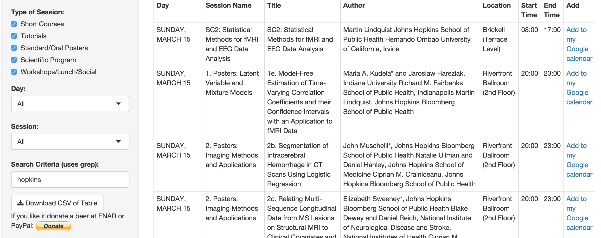

```{r label=opts, results='hide', echo=FALSE, message = FALSE, warning=FALSE}
library(knitr)
opts_chunk$set(echo=FALSE, prompt=FALSE, message=FALSE, warning=FALSE, comment="", results='hide')
```

It's almost ENAR 2015!  The [final program](http://www.enar.org/meetings/spring2015/program/2015_final_program.pdf) is out with all the sessions.  The last conference I went to, the [International Stroke Conference](http://www.strokeconference.org), had a [program planner](http://www.abstractsonline.com/plan/start.aspx?mkey=%7B4689C2A6-B858-4AEC-BEE5-01F8711CF9BD%7D) hosted by [abstracts online](http://www.abstractmanagement.com/).  

Although there are parts of this system I would like to change, I believe it is helpful for looking up sessions, presenters, and especially posters.  Therefore, I introduce


<div style="font-size:xx-large; text-align: center;"> [John Muschelli's ENAR 2015 Itinerary Maker](https://muschellij2.shinyapps.io/ENAR_2015/) </div>

## Functions and How to Use
Here is an example screen shot of the [shiny app](https://muschellij2.shinyapps.io/ENAR_2015/):



Each of the functions are as follows:

* Type of Session - you can choose from different session types, whether you want to limit to posters or short courses
* Select the day to subset data
* Select a specific session
* Search - this text field uses [grep](https://stat.ethz.ch/R-manual/R-devel/library/base/html/grep.html) (after lower casing the field) to search the title and autor fields for relevant text.
* Download - this will download a CSV file of the subsetted table.  Now note that this will not be *exactly* the table, but a Google Calendar-friendly format.  This will be discussed in the next session.
* Donate button: I spent a good deal of work on this app and I believe it improves the conference.  If you agree and would like to donate some money and/or a beer at ENAR 2015, I'd appreciate it.  

## Export to Google Calendar
### Individual Talks
Each individual session can be added to a Google Calendar using the **Add to my Google calendar** button next to each session.  For standard posters, this will add the poster as the entire poster session.  For specific talks, it will not add the complete session, but simply that talk.  

### Exporting CSV and Uploading to Google Calendar
Create a new google calendar, let's call it "ENAR 2015". Downloading a CSV of sessions you would like to attend or download the entire table and filter them in R/Excel.  In Google Calendar, go to Other Calendars, click the down arrow and select 'Import Calendar', upload the CSV and select your new calendar ENAR 2015, the records should be imported.  If this is unclear, I made a [3 minute Youtube video](https://www.youtube.com/watch?v=DGIlLGl0VpQ&feature=youtu.be) of this step-by-step process.

## Feedback
Is any information is incorrect please let me know, either at [\@StrictlyStat](https://twitter.com/StrictlyStat) or <muschellij2@gmail.com>.  I spent a good deal of time cleaning the text from the PDF so I believe it should be mostly correct but obviously any last-minute changes I did not capture.

## My Sessions
Please stop by the poster session [Poster Number 2b. (PDF of poster)](http://muschellij2.github.io/ENAR_2015_Poster/Muschelli_John_CT_ICH_Segmentation_Poster.pdf) and if you're interested in neuroimaging processing and using R, please sign up for the "T4: A Tutorial for Multisequence Clinical Structural Brain MRI" that we are running.

### If the app crashes
A backup (or mirror) shiny app is located at [http://162.129.13.127/ENAR_2015/](http://162.129.13.127/ENAR_2015/). 

## Code for app
The app is hosted on [my GitHub](https://github.com/muschellij2/ENAR_2015) along with the data used to run the app.