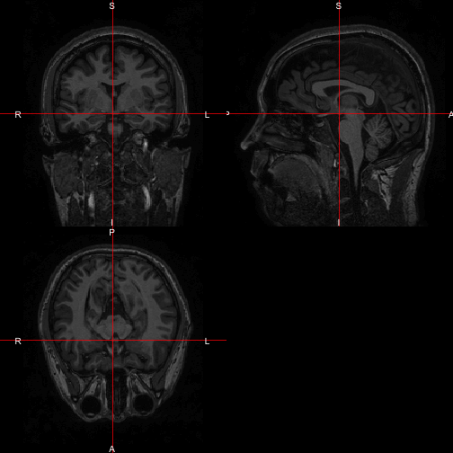
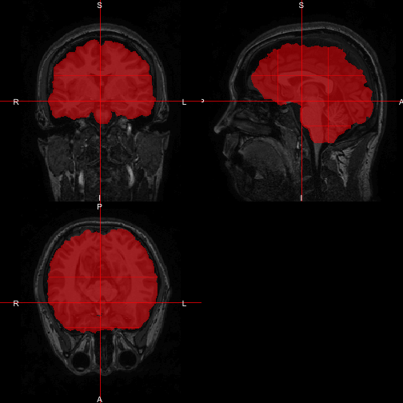
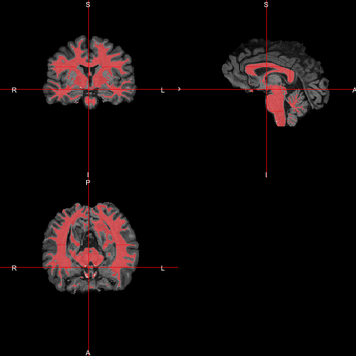
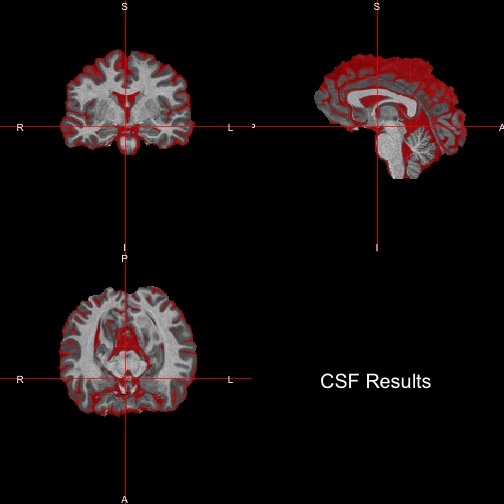
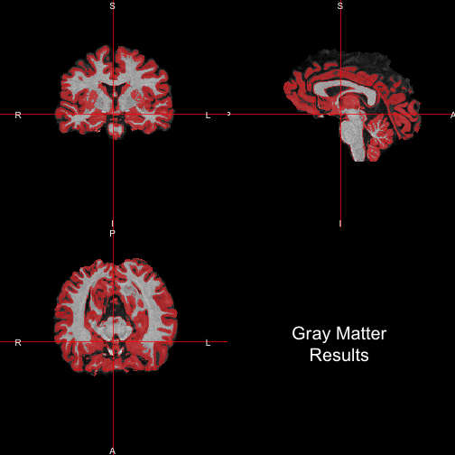

# Goals and Overall Approach

We will use multiple packages and pieces of software for white matter (and gray matter/cerebro spinal fluid (CSF)) segmentation. 

The overall approach will be, with the required packages in parentheses:

1. [N4 Inhomogeneity Bias-Field Correction](http://www.ncbi.nlm.nih.gov/pmc/articles/PMC3071855/) (`extrantsr` and `ANTsR`)
2. Brain extraction using [BET](http://fsl.fmrib.ox.ac.uk/fsl/fslwiki/BET) and additional tools (`extrantsr` and `fslr`)
3. [FAST](http://fsl.fmrib.ox.ac.uk/fsl/fslwiki/FAST) for tissue-class segmentation.  (`fslr`)

## Installing Packages
Below is a script to install all the current development versions of all packages.  The current `fslr` packages depends on `oro.nifti (>= 0.5.0)` , which is located at [`muschellij2/oro.nifti`](https://github.com/muschellij2/oro.nifti) or [`bjw34032/oro.nifti`](https://github.com/bjw34032/oro.nifti).  

Note, the `ITKR` and `ANTsR` packages can take a long time to compile.  The `extrantsr` package builds on `ANTsR` and makes some convenience wrapper functions.


```r
devtools::install_github("muschellij2/oro.nifti")
devtools::install_github("muschellij2/fslr")
devtools::install_github("stnava/cmaker")
devtools::install_github("stnava/ITKR")
devtools::install_github("stnava/ANTsR")
devtools::install_github("muschellij2/extrantsr")
install.packages("scales")
```

# Load in the packages

Here we will load in the required packages.  The `scales` package is imported just for the `alpha` function, used below in plotting.


```r
rm(list=ls())
library(fslr)
library(extrantsr)
library(scales)
```

## Specifying FSL path

For `fslr` to work, [FSL](http://fsl.fmrib.ox.ac.uk/fsl/fslwiki/) must be installed.  If run in the Terminal, the `FSLDIR` environmental variable should be found using `R`'s `Sys.getenv("FSLDIR")` function.

If run in an IDE (such as RStudio or the R GUI), `R` must know the path of FSL, as set by the following code:


```r
options(fsl.path="/usr/local/fsl/")
```

## Image Filenames

Here we will set the image name.  The `nii.stub` function will strip off the `.nii.gz` from `img.name`.


```r
img.name = "SUBJ0001-01-MPRAGE.nii.gz"
img.stub = nii.stub(img.name)
```

# N4 Bias Field Correction

The first step in most MRI analysis is performing inhomogeneity correction.  The `extrantsr` function `bias_correct` can perform N3 or N4 bias correction from the `ANTsR` package.  


```r
n4img = bias_correct( img.name, correction = "N4", 
                      outfile = paste0(img.stub, "_N4.nii.gz") )
ortho2(n4img)
```

 

Let us note that the image is of the head and a bit of the neck.  We wish to perform white matter segmentation only on the brain tissues, so we will do brain extraction.

# Brain Extraction

The `extrantsr` function `fslbet_robust` performs brain extraction.  It relies on the `fslr` function `fslbet` which calls `bet` from FSL.  It also performs neck removal (`remove.neck = TRUE`) and will perform BET once and then estimate a new center of gravity (COG) and then re-run BET.  These functions are implemented in `fslbet` specifically, but these have been re-implemented in `fslbet_robust` in a slightly different way.  `fslbet_robust` will also perform N4 inhomogeneity correction, but as this has already been performed above, we will set `correct = FALSE`.  

For neck removal, a template brain and mask must be specified.  We will use the T1, 1mm resolution, MNI brain included with FSL's installation.


```r
bet = fslbet_robust(img = n4img, 
                    retimg = TRUE,
                    remove.neck = TRUE,
                    robust.mask = FALSE,
                    template.file = file.path( fsldir(), 
                                               "data/standard", 
                                               "MNI152_T1_1mm_brain.nii.gz"),
                    template.mask = file.path( fsldir(), 
                                               "data/standard", 
                                               "MNI152_T1_1mm_brain_mask.nii.gz"), 
                    outfile = "SUBJ0001-01-MPRAGE_N4_BET", 
                    correct = FALSE)
```

The results look good - the brain tissue is kept (in red) only.  Not much brain tissue is discarded nor non-brain-tissue is included.


```r
ortho2(n4img, bet > 0, 
       col.y=alpha("red", 0.5))
```

 

# FAST Image Segmentation

Now that we have a brain image, we can use FAST for image segmentation.  We will use the `fslr` function `fast`, which calls `fast` from FSL.  We will pass the `-N` option so that FAST will not perform inhomogeneity correction (different from N4 and N3), because we had performed this before.


```r
fast = fast(file = bet, 
            outfile = paste0(img.stub, "_BET_FAST"), 
            opts = '-N')
```

## White Matter Results

By default, FAST assumes 3 tissue classes, generally white matter, gray matter, and CSF.  These are generally ordered by the mean intensity of the class.  For T1-weighted images, white matter is the highest intensity, and assigned class `3`.  Let's see the results:


```r
ortho2(bet, fast == 3, 
       col.y=alpha("red", 0.5))
```

 


## Gray Matter / CSF Results

We can also visualize the classes for `1` and `2` for CSF and gray matter, respectively.  


```r
ortho2(bet, fast == 1, col.y=alpha("red", 0.5), text="CSF Results")
```

 

```r
ortho2(bet, fast == 2, col.y=alpha("red", 0.5), text="Gray Matter\nResults")
```

 

The results indicate good segmentation of the T1 image.  The `fslr` function `fast` result in more than the tissue-class segmentation, see the other files output:


```r
list.files(pattern=paste0(img.stub, "_BET_FAST"))
```

```
[1] "SUBJ0001-01-MPRAGE_BET_FAST_mixeltype.nii.gz"
[2] "SUBJ0001-01-MPRAGE_BET_FAST_pve_0.nii.gz"    
[3] "SUBJ0001-01-MPRAGE_BET_FAST_pve_1.nii.gz"    
[4] "SUBJ0001-01-MPRAGE_BET_FAST_pve_2.nii.gz"    
[5] "SUBJ0001-01-MPRAGE_BET_FAST_pveseg.nii.gz"   
[6] "SUBJ0001-01-MPRAGE_BET_FAST_seg.nii.gz"      
```

## Notes
The `fslr` function `ortho2` is a rewrite of the `oro.nifti::orthographic` function, but with different defaults and will set values of `0` in the second image (`y` argument) to `NA`.  

