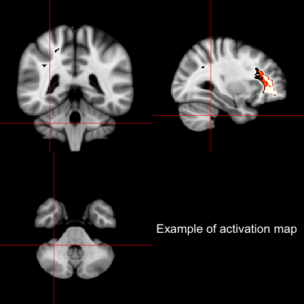

In my work, we have come across problems where we wanted to visualize data in 4 dimensions (4D).  The data came as brains, which are represented as 3D volumes and we wanted to visualize them at different time points (hence 4D).  We were using images that are acquired one image per visit (CT structural scans, particularly), where each patient had a maximum of 10 time points.  (The methods below have not been tested or adapted for fMRI scans that have hundreds of time points). 

As a result, [we](http://works.bepress.com/john_muschelli/3/) created the package `brainR` ([CRAN package](http://cran.r-project.org/web/packages/brainR/index.html)) to fit our needs with this.  We strive to make figures such as [this 4D example](http://muschellij2.github.io/WebGL_Interactive_Paper/supp_2/index_4D_stl.html). 

<iframe width="600" height="500" src="http://muschellij2.github.io/WebGL_Interactive_Paper/supp_2/index_4D_stl.html"  style="display:block;margin: 0 auto;"></iframe>

This figure can be rotatated and zoomed.  The slider provides a changing opacity for the overall brain (in order to see the structures inside).  The buttons for each "visit" represent enhanced lesions in patients with MS detected by SuBLIME (<a href="">Sweeney et al. 2013</a>).  I feel that these figures can convey results that an orthographic figure such as

cannot, nor can a single slice over time as these enhancing lesions are all over the brain.

The steps to make images such asin `brainR` is this:

1. Read (neuro)imaging data (usually using `oro.dicom` or `oro.nifti` packages).
2. Have 1) a brain to plot and 2) a region of interest (ROI) in the same space as the brain
3. Create a `scene` using `contour3d` from `misc3d` package (<a href="http://www.jstatsoft.org/v28/i01/">Feng & Tierney, 2008</a>).
4. Write the contents of this scene into 3D objects of formats [`STL`](http://en.wikipedia.org/wiki/STL_(file_format)) or [`OBJ`](http://en.wikipedia.org/wiki/Wavefront_.obj_file) using wrappers for `writeSTL` or `writeOBJ` from `rgl package (<a href="http://CRAN.R-project.org/package=rgl">Adler et al. 2014</a>).
5.  Use the [X ToolKit (XTK)](https://github.com/xtk/X#readme) and simple JavaScript controls to visualize these structures and switch between them.

The last step is what I call 4D visualization, being able to move around space with rotation, zooming, and translation while moving through another dimension, usually different time points, ROIs, structures, etc.  The reason we went this route is a few reasons, but particularly:

1.  I know `R`
2. `rgl` and `misc3d` already exist
3. JavaScript is "accessible" and has a lot of docs/support
4. Going further into 4D visualization in software is essentially video game programming or using a language I don't know

Number 4. was interesting as I looked into tools like [Blender](http://www.blender.org/), [Paraview](http://www.paraview.org/), or [CINEMA 4D](http://www.maxon.net/products/cinema-4d-prime/who-should-use-it.html), which are are highly powerful.  Many of them have a GUI-only interface and some used for much visualizing more extensive than (and not adapted so well for) biomedical data, such as full scenes and landscapes.  Most solutions, such as those for [MATLAB](http://www.mathworks.com/matlabcentral/fileexchange/41465-4d-volume-visualization), require the user either have MATLAB programming experience or download software, which we found to be a large and unneccesary burden - so we use JavaScript in a browser.  Granted, to run `brainR` you need to know `R`, but the end user just needs to know how to open a browser.  If the end user cannot do that, I don't think 4D visualization is for them anyway.

Now, let's rundown some of the functions:
   * `write4D` takes in a "scene", which is a collection of surfaces, and writes them to an html, along with the STL or OBJ files needed to render it.
   * `makeScene` is an adaptation of `contour3d` from `misc3d` that does mutually exclusive leveling.  For example, if you have an image that has values {1, 2, 3}, then you can create an individual surface for 1, one for 2, one for 3.  With `contour3d`, they take the values $\geq$ to the level for the surface, which means that the surface for 2 would contain 2 and 3.  
   * `writeWebGL_split` is an adaptation of `rgl`'s `writeWebGL` but cuts the objects into individual objects of only `65535` vertices (see [here](http://stackoverflow.com/questions/4998278/is-there-a-limit-of-vertices-in-webgl) for discussion of WebGL number of vertices, see [here](https://stat.ethz.ch/pipermail/r-help//2012-November/341068.html) for discussion with Duncan Murdoch).  This is a limitation of WebGL rendering and we simply split the data using the code given by Duncan Murdoch in the second link.  (`writeWebGL` has a note in the details, but I missed it).  Why is this important? If you don't do the splitting, your surface will not render properly, if at all.  
   

Overall, this is my first package and the paper is submitted to [R Journal](http://journal.r-project.org/).  The admins at [CRAN](http://cran.us.r-project.org/) were very helpful in getting the package ready for production.  It wasn't easy, but it's done.

The development version of `brainR` is located at this [gitHub package](https://github.com/muschellij2/brainR).  
   
   Note, there is some interesting work done with 3D objects (and some 4D functionality) into PDF [recently](http://www.plosone.org/article/info%3Adoi%2F10.1371%2Fjournal.pone.0069446) and there is interesting overview of methods tried [located here](http://www.plosone.org/article/info%3Adoi%2F10.1371%2Fjournal.pone.0079004) if you're interested.  We chose the web because it rendered faster and had easier integration with JavaScript.  

Citations were done using `knitcitations` (<a href="http://CRAN.R-project.org/package=rgl">Adler et al. 2014</a>).
