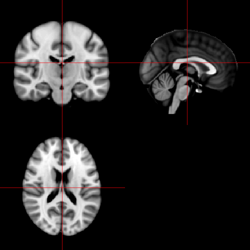
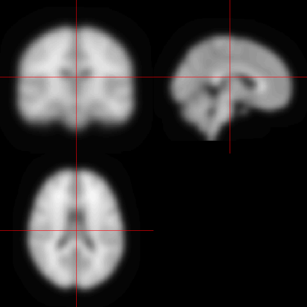
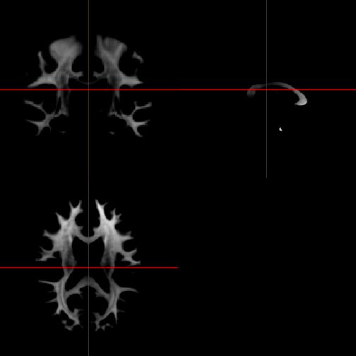
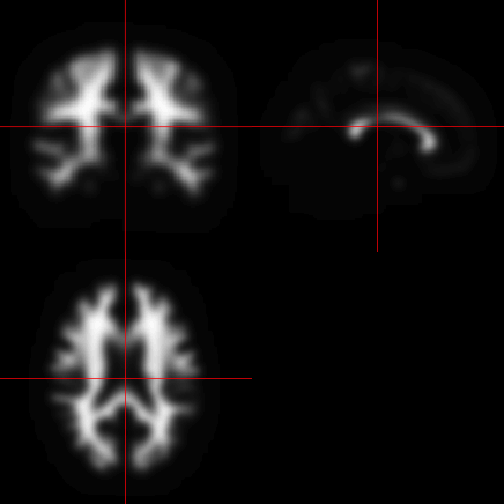

I use a set of neuroimaging tools, but my language of choice is `R`.  [FSL](http://fsl.fmrib.ox.ac.uk/fsl/fslwiki/), which is from the University of Oxford's Functional MRI of the Brain (FMRIB), and stands for FMRIB Software Library, is one tool I commonly use.  I wrote some wrapper functions into an [`R` package called `fslr`](http://cran.r-project.org/web/packages/fslr/index.html) and wanted to discuss some of the functions.  

## FSL - what is it?
FSL is has a command line interface with shell-type syntax as well as a GUI (which I generally don't use).  It has a lot of functions that are good for general imaging purposes - `fslstats` and `fslmaths` have loads of functionality.  Using FSL during your pipeline is fine, but I don't like switching between shell and `R` too much in an analysis and like to have scripts that don't jump around too much, so I created `fslr`.

One of the main problems I have is that I read an image into `R`, manipulate it in some way, and then want to use an FSL function on that manipulated.  This presents a problem because I have an `R` object and not a NIfTI file, which FSL expects.  I also want the result back in R, not in a file that I have to then find.  `fslr` bridges the gap between `R` and FSL.

## fslr functionality
`fslr` is implicitly linked to the `oro.nifti` by [Brandon Whitcher](http://www2.imperial.ac.uk/~bwhitche/software/).  The workflow is this:
1.  Read NIfTI data into `R` using `readNIfTI` from `oro.nifti`.  This is now an `R` object of class `nifti`. 
2.  Manipulate the data in some way.  Maybe you applied a mask or changed some values.
3.  Pass this `nifti` object to a function in `fslr`, which will write the object to a temporary NIfTI file, run the FSL command, and read the result into an `R` `nifti` object again using `readNIfTI`.

From the user's perspective, it's how it always is in `R`: pass in `R` object to `R` function and get out `R` object.  

Alternatively, if the user specifies a filename of a NIfTI file instead of passing in an `R` object, `fslr` commands will simply run the FSL command without the file ever having to be read into `R`, yet the result can still be returned in `R` as an `R` object.  This method may be much faster, especially if the image for the function to operate on is on the hard disk (otherwise it would be read in and written out before an FSL command was run).

## `outfile` and `retimg` options
For any function that has an image output should have two arguments: `outfile` and `retimg`.  The argument `outfile` is default set to `NULL`, which will create a temporary file using `tempfile()`, which will be deleted when your `R` session is terminated.  Alternatively, you can specify a path to the output file if the user wants it saved to disk.

The `retimg` argument is a logical indicator for whether you want the output read into `R` and returned (get it - **ret**urn **im**a**g**e).  If `retimg=FALSE` and `outfile=NULL`, then the function will error as the `outfile` will be a temporary file and deleted and no image will be returned.  Thus, the user will not ever be able to use the output image from the function which I believe is done in error.

### Function call-outs
All functions use the `system` command in `R` to execute FSL commands.  If you are using an `R` GUI instead of the command line in a shell, then you will want to specify `options(fsl.path=)`.  If you are using the command line and FSL is in your PATH, the path to FSL will be found using `Sys.getenv("FSLDIR")` as your shell evnironment variables will be available. The function `have.fsl()` provides a logical check as to whether you can run an `fslr` command.  I have not tested this on a Windows machine.  I did not use `system2` because I ran into some problems, but may want to change this in a future release for portability.  Let's look at an example of using `fslr`


## Example of `fslr` commands
Let's check to make sure we have FSL in our PATH:

```r
library(fslr)
```

```
## Loading required package: stringr
## Loading required package: oro.nifti
## 
## oro.nifti: Rigorous - NIfTI+ANALYZE+AFNI Input / Output (version = 0.4.0)
## 
## Loading required package: matrixStats
## matrixStats v0.9.7 (2014-06-05) successfully loaded. See ?matrixStats for help.
```

```r
options(fsl.path="/usr/local/fsl")
have.fsl()
```

```
## [1] TRUE
```
Similarly to `fsl.path`, you should specify an output type, usually `NIFTI_GZ`.  See [here for more information about output type](http://fsl.fmrib.ox.ac.uk/fsl/fsl-4.1.9/fsl/formats.html).


```r
options(fsl.outputtype = "NIFTI_GZ")
```

### Reading in Data
Here I'm going to read in a template T1 MRI brain image (no skull), with 1mm resolution and visualize it.

```r
fname = file.path( getOption("fsl.path"), "data", "standard", "MNI152_T1_1mm_brain.nii.gz")
img = readNIfTI(fname)
print(img)
```

```
## NIfTI-1 format
##   Type            : nifti
##   Data Type       : 4 (INT16)
##   Bits per Pixel  : 16
##   Slice Code      : 0 (Unknown)
##   Intent Code     : 0 (None)
##   Qform Code      : 4 (MNI_152)
##   Sform Code      : 4 (MNI_152)
##   Dimension       : 182 x 218 x 182
##   Pixel Dimension : 1 x 1 x 1
##   Voxel Units     : mm
##   Time Units      : sec
```

```r
orthographic(img)
```

 

### Smoothing
Let's smooth the data using a 5mm Gaussian kernel and view the results:

```r
smooth = fslsmooth(img, sigma = 5, retimg=TRUE)
orthographic(smooth)
```

 

That example is a little boring in that this could be much easier done in FSL than using `fslr`.  If the data is manipulated beforehand, and in an explorative way, it may be easier to see `fslr`'s use.  Let's Z-score the image and then keep the z-scores above 2.

### Z-score and threshold

```r
thresh.img = img
thresh.img = (thresh.img - mean(thresh.img))/sd(thresh.img)
thresh.img[thresh.img < 2] = NA
orthographic(thresh.img)
```

 
What? An empty picture?  That doesn't make sense.  Looking at the histogram of `thresh.img` we see there is data:

```r
hist(thresh.img)
```

 

So what gives?  The `orthographic` function from `oro.nifti` uses the slots `cal_min` and `cal_max` to determine the grayscale for the picture.  `fslr` also has some helper functions to make it easier to rescale these values so that you can visualize the images again.

### Setting `cal_min` and `cal_max`

```r
thresh.img = cal_img(thresh.img)
orthographic(thresh.img)
```

 
There we go.  Looks like some white matter regions.  Now let's smooth these z-scores using a 4mm Gaussian kernel.


```r
smooth.thresh = fslsmooth(thresh.img, sigma = 4, retimg=TRUE)
orthographic(smooth.thresh)
```

 

Now you can do all your fun statistics and be able to call FSL and keep everything in `R`!  Also for most of the functions, there is a `FUNCTION.help` function that will print out FSL's help file:

```r
fslhd.help()
```

```
## 
## Usage: fslhd [-x] <input>
##        -x : instead print an XML-style NIFTI header
```


## But other packages exist!!
Some may think "Hmm I had a package with that functionality decades ago".  Other packages in `R` exist and have functions for images.  I know this.  But I believe:

1.  `R` should be able to integrate other established and available neuroimaging software. Python is doing this everywhere and seems to be helpful for the Python part of the community.
2.  Some of the functions the FSL package have are not implemented in `R`.  What package do I call for skull-stripping an image like the BET from FSL?  You can call `fslbet` by the way in `fslr`.
3.  Some functions are faster in FSL than in some functions of `R`.  Large 3D Gaussian smoothers take a long time in some packages of `R`.
4.  It allows you to still your pipeline written in `R` even if it calls `FSL` or other languages.
5.  If someone wrote it before, I don't want to write it again.

I am writing up a more comprehensive white paper hopefully in the coming weeks.  Don't forget to check out other packages like [`ANTsR`](http://stnava.github.io/ANTsR/ANTsRGettingStarted.html) which is a wrapper for ANTS in `R`.  I'm excited to start using it, especially for its MRI inhomogeneity correction.

### Work to be done
I haven't implemented much of the software for FEAT, which is part of FSL's fMRI analysis pipeline.  I hope to do that in the future, but would love feedback if people would want that integration.  Always - feedback is welcome on other parts as well.
