Recently, [Jeff Leek](http://jtleek.com/) had proposed something at tea time:

> Why should I switch over to [ggplot2](http://ggplot2.org/)? I can do everythign in base graphics.

I have heard this argument before and I understand it for the most part.  Many people have learned `R` before `ggplot2` came on the scene and learned to do all the things they needed to.  Some don't understand the new syntax for plotting and argue the learning curve is not worth the effort.  Also, many say it's not straightforward to customize.


As the discussion progressed, I told him to send me 10 plots that he commonly makes, and I would recreate them in `ggplot2`.  The goal was to help him break into `ggplot2` if necessary, and also see if they were "as easy" as doing them in base.  He proposed the first one -- a heatmap -- and I want to discuss that and the fact that `ggplot2` is not ALWAYS the answer, nor was it supposed to be. 

## First Plot - Heatmap

The first example he gave me was a heatmap that had 100,000 rows and 100 columns with a good default color scheme.  As a comparison, I used `heatmap` in base `R`.  Let's do only 10,000 to start:


```r
N = 1e4
mat = matrix(rnorm(100*N), nrow=N, ncol=100)
colnames(mat) = paste0("Col", seq(ncol(mat)))
rownames(mat) = paste0("Row", seq(nrow(mat)))
system.time({heatmap(mat)})
```

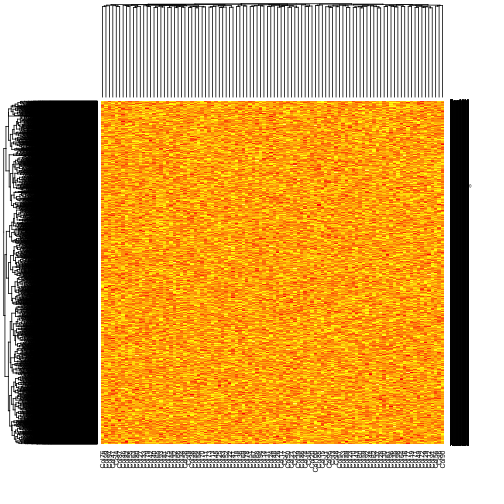 

```
   user  system elapsed 
 29.996   1.032  31.212 
```


For this, I used `geom_tile` and wanted to look at the results.  Note, `ggplot2` requires the data to be in "long" format, so I had to reshape the data.


```r
library(reshape2)
library(ggplot2)
df = melt(mat, varnames = c("row", "col"))
system.time({
  print({ 
    g= ggplot(df, aes(x = col, y = row, fill = value)) + 
      geom_tile()}) 
  })
```

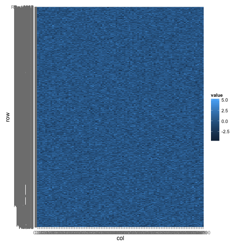 

```
   user  system elapsed 
  9.519   0.675  10.394 
```

One of the problems is that `heatmap` does clustering by default, so the comparison is not really fair (but still using "defaults" - as Jeff specified).  Let's do the `heatmap` again without the clustering.


```r
system.time({heatmap(mat, Rowv = NA, Colv = NA)})
```

 

```
   user  system elapsed 
  0.563   0.035   0.605 
```

Which one looks better? I'm not really sure, but I do like the red/orange coloring scheme - I can differences a bit better.  The `ggplot` graph does have a built-in legend of the values, which is many times necessary.  Note, the rows of the `heatmap` are shown as columns and the columns shown as rows, a usually well-known fact for users of the `image` function.  The `ggplot` graph plots as you would a scatterplot -- up on x-axis and right on the y-axis are increasing.  If we want to represent rows as rows and columns as columns, we can switch the `x` and `y` aesthetics, but I wanted as close to `heatmap` as possible.

### Don't factor the rows
Note, I named the matrix rows and columns, if I don't do this, the plotting will be faster, albeit slightly.


```r
N = 1e4
mat = matrix(rnorm(100*N), nrow=N, ncol=100)
df = melt(mat, varnames = c("row", "col"))

system.time({heatmap(mat, Rowv = NA, Colv = NA)})
```

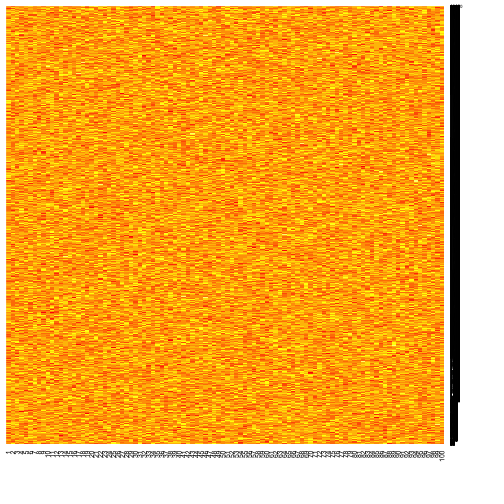 

```
   user  system elapsed 
  0.642   0.017   0.675 
```

```r
system.time({
  print({ 
    g= ggplot(df, aes(x = col, y = row, fill = value)) + 
      geom_tile()}) 
  })
```

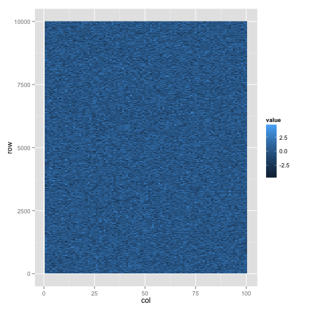 

```
   user  system elapsed 
  9.814   1.260  11.141 
```

### 20,000 Observations
I'm going to double it and do 20,000 observations and again not do any clustering:


```r
N = 2e4
mat = matrix(rnorm(100*N), nrow=N, ncol=100)
colnames(mat) = paste0("Col", seq(ncol(mat)))
rownames(mat) = paste0("Row", seq(nrow(mat)))
df = melt(mat, varnames = c("row", "col"))

system.time({heatmap(mat, Rowv = NA, Colv = NA)})
```

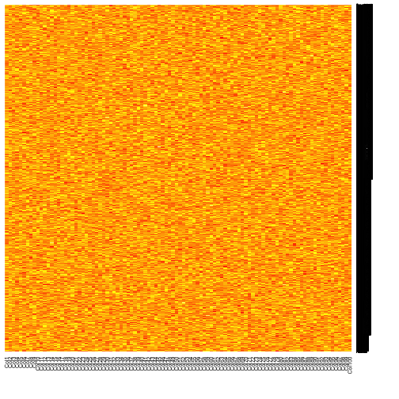 

```
   user  system elapsed 
  1.076   0.063   1.144 
```

```r
system.time({
  print({ 
    g= ggplot(df, aes(x = col, y = row, fill = value)) + 
      geom_tile()}) 
  })
```

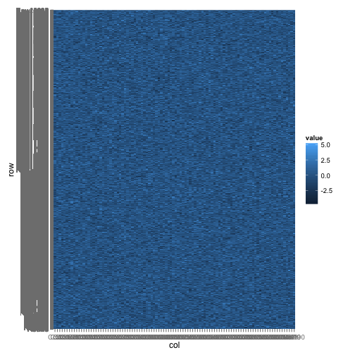 

```
   user  system elapsed 
 17.799   1.336  19.204 
```

### 100,000 Observations
Let's scale up to the 100,000 observations Jeff requested.


```r
N = 1e5
mat = matrix(rnorm(100*N), nrow=N, ncol=100)
colnames(mat) = paste0("Col", seq(ncol(mat)))
rownames(mat) = paste0("Row", seq(nrow(mat)))
df = melt(mat, varnames = c("row", "col"))

system.time({heatmap(mat, Rowv = NA, Colv = NA)})
```

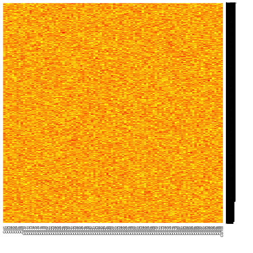 

```
   user  system elapsed 
  5.999   0.348   6.413 
```

```r
system.time({
  print({ 
    g= ggplot(df, aes(x = col, y = row, fill = value)) + 
      geom_tile()}) 
  })
```

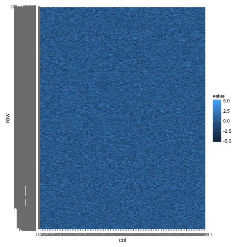 

```
   user  system elapsed 
104.659   6.977 111.796 
```


We see that `heatmap` and `geom_tile()` scale with the number observations on how long it takes to plot, but `heatmap` being **much** quicker.  There may be better ways to do this in `ggplot2`, but after looking around, it looks like `geom_tile()` is it.  Overall, for doing heatmaps of this size, I would use the `heatmap`, after transposing the matrix,s and something like `seq_gradient_pal` from the `scales` package for color mapping or `RColorBrewer`.  Like I said, `ggplot2` is not ALWAYS the answer; nor was it supposed to be.  

For smaller dimensions, I'd definitely use `geom_tile()`, especially if I wanted to do something like [map text to the blocks as well](https://www.biostars.org/p/56291/).  The other benefit is that no transposition needs to be done, but the data does need to be reshaped explicitly.  


# Strengths of `ggplot2` for me
The overall question still remains: why (do I) use `ggplot2`?

For me, `ggplot2` destroyed the idea of me using the `lattice` package.  The `lattice` package is a great system, but I believe you should choose it or `ggplot2` and I chose `ggplot2` for the syntax, added capabilities, and the philosophy behind it.  The fact [Hadley Wickham](http://had.co.nz/) is the developer never hurts either.  

## Having multiple versions of the same plot, with slight changes
Many times when I plot I want to do the same plot over and over, but vary one aspect of it, such as color by one grouping variable, and then switch which grouping variable.  Let me give a toy example, where we have an `x` and a `y` with two grouping variables: `group1` and `group2`. 


```r
data = data.frame(x = rnorm(1000, mean=6))
data$group1 = rbinom(n = 1000, size =1 , prob =0.5)
data$y = data$x * 5 + rnorm(1000)
data$group2 = runif(1000) > 0.2
```

We can construct the `ggplot2` object as follows:

```r
g = ggplot(data, aes(x = x, y=y)) + geom_point()
```
We use `ggplot` to say which `data.frame` you want to use (you need to make your data like this) and use the `aes` to specificy which aesthetics we want to specify.  Some aesthetics are optional depending on the plot, some are not.  I think it's safe to say you always need `x`.  I then "add" to this object a "layer": I want a geometric thing, and that thing are points.  I'm doing a scatterplot.

If you just call the object `g`, `print` by default is called, which plots the object and we see our scatterplot.

```r
g
```

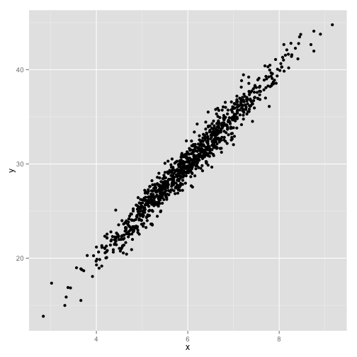 

I want to colour by a different variable we can add that aesthetic:

```r
g + aes(colour = group1)
```

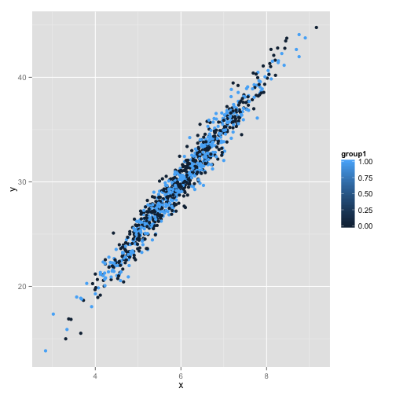 

```r
g + aes(colour = factor(group1))
```

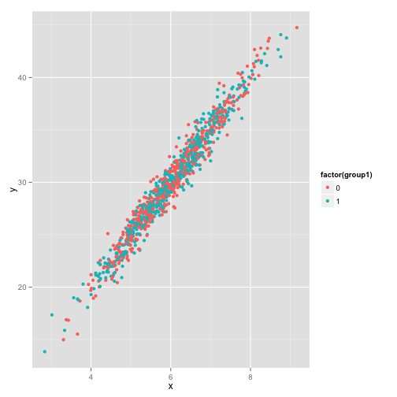 

```r
g + aes(colour = group2)
```

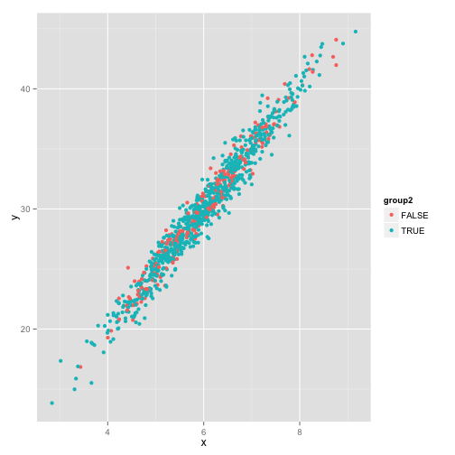 

We see in the first plot, `ggplot2` sees a numeric variable, so tries a continuous mapping scheme for the color.  If we want to force it to a discrete mapping, we can turn it into a factor (second plot).  The third plot shows that `ggplot2` takes logical vectors and factors them for mapping.  

### Slight Changes
I do this a lot: the same plot with slight changes.  In the previous example, we colored by a different variable.  In other examples, I tend to change little things, e.g. a different smoother in this one, a different subset, constraining the values to this range, etc.  I believe in this way, `ggplot2` allows us to create plots in an iterative way, without copying and pasting.  This should increase reproducibility by decreasing copy-and-paste errors.  I have a lot of those, so I want to limit them as much as possible.

### Another Case this is Useful - Save Plot Twice
Many other times, I open up a PDF device using `pdf`, make a series of plots, and then close the PDF, but I want to make a high-res PNG of one of those plots.  I want both -- the PDF and PNG.  For example:


```r
pdf(tempfile())
print({g1 = g + aes(colour = group1)})
print({g1fac = g + aes(colour = factor(group1))})
print({g2 = g + aes(colour = group2)})
dev.off()
```

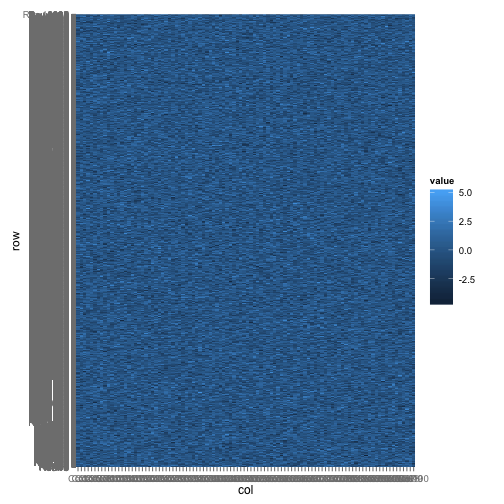 

```r
png(tempfile(), res = 300, height =7, width= 7, units = "in")
print(g2)
dev.off()
```

No copying and pasting was needed for this and I have found it useful.

## Examples I use a lot
I also make scatterplots a lot and use a smoother to estimate the shape of data.  I usually have to run at least 3 commands to do this, e.g. `loess` and `plot`, and `lines`.  In `ggplot2`, `geom_smooth()` takes care of this for you.   Moreover, it does the smoothing by each different aesthetics (aka smoothing per group), which is usually what I want do as well (and takes more than 3 lines in base).  By default, it includes the standard error of the estimated relationship, but I usually only look at the estimate for a rough sketch of the relationship.


```r
g2 + geom_smooth()
```

 

```r
g2 + geom_smooth(se = FALSE)
```

 

### Faceting
The other reason I frequently use `ggplot2` is for faceting.


## ggplot2 does not make publication-ready figures
I want to state this again: **ggplot2 does not make publication-ready figures**.  Neither does base graphics.   Overall, a publication-ready figure takes time, customization, consideration about point size, color, line types, and other aspects of the plot, and usually stitching together multiple plots.  `ggplot2` has a lot of default features that have given considerate thought to color and these other factors, but one size does not fit all.

And in this I agree with Jeff: many people make a plot in `ggplot2` and it looks good and they do not put the work in to make it publication-ready.  How many times have you seen the muted green and red/pink color that is the default first 2 colors in a `ggplot2` plot?


## Why all the ggplot2 hate?
I'm not hating on `ggplot2`; I use it often and value it.  I think it makes graphs that by default look better than many base alternatives.  I do not think that these are ready-set-go for publication.

I do think base `R` graphics are still useful and `ggplot2` is not ALWAYS the answer.  Again, it was never supposed to be.
